# Acme Corp Minecraft Server Automation
## CS 312 Course Project Part 2
Ah! Your first day on the job! You recently got hired as a system administrator for Acme Corp. Rumor has it that the previous sysadmin got caught by InfoSec for using his work computer to watch NSFW content. Terminated in less than a week. Ruthless HR.

Your manager tells you that the most pressing item is to get the Minecraft server back up and running. Employees are growing restless.

It seems your predecessor did a lot of their tasks manually, but at least they did a decent job of documenting their work. 

You want to showcase your skills and (maybe?) get fast-tracked for a promotion. You crack your knuckles and get to work.


## 📚 Background
In this project, we’ll fully automate the provisioning, configuration, and deployment of an AWS-hosted Minecraft server for Acme Corp. Everything is scripted using Terraform (infra) and Ansible (config). No need to ssh or even touch the AWS console. 

## 🔧 Requirements

Before you begin, ensure you have the following installed and configured:

- **AWS CLI v2** configured with a named profile (`acme-minecraft`) in `~/.aws/credentials`.
- **Terraform CLI**
- **Ansible CLI**
- **SSH key-pair** named `minecraft` imported into AWS and available in `~/.ssh/minecraft` (private key) and `~/.ssh/minecraft.pub` (public key).

### Environment Variables / AWS Profile

Configure AWS profile with cli credentials

```bash
aws configure --profile acme-minecraft
```

Verify it works:

```bash
aws sts get-caller-identity --profile acme-minecraft
```

## 📈 Architecture Diagram

```mermaid
flowchart LR
  subgraph Control_Plane
    CLI[Terraform & Ansible CLI]
    Env["~/.ssh/minecraft<br/>AWS Profile"]
  end

  subgraph AWS["AWS Account"]
    direction TB
    IGW[Internet Gateway]
    RT[Route Table]
    VPC[VPC<br/>10.0.0.0/16]
    SUB[Public Subnet<br/>10.0.1.0/24]
    SG[Security Group<br/>TCP 22,25565]
    EC2[EC2 Instance<br/>Ubuntu 22.04]
  end

  CLI -->|API calls| VPC
  VPC --> SUB
  SUB --> IGW
  SUB --> SG
  SG --> EC2
  CLI -->|SSH on 22| EC2
  User[“Minecraft Client”] -->|25565| EC2
```


## ⚙️ Pipeline Steps

1. **Clone the repository**

   ```bash
   git clone https://github.com/mbauer575/acme-minecraft.git
   cd acme-minecraft/infra
   ```

2. **Provision AWS infrastructure with Terraform**

   ```bash
   terraform init
   terraform plan -var="ssh_key_name=minecraft"
   terraform apply -auto-approve -var="ssh_key_name=minecraft"
   ```

   - Initializes Terraform, shows the plan, and applies it.
   - Outputs the public IP as `server_ip`.

3. **Configure the Minecraft server with Ansible**

   ```bash
   # Move to the config folder
   cd ../config
   ```
   - Update IP field in hosts.ini [VM-IP] -> x.x.x.x
   ```
   # Run the playbook
   ansible-playbook -i hosts.ini playbook.yml
   ```

4. **Verify the service**

   ```bash
   # Scan port 25565 to confirm Minecraft is listening
   nmap -sV -Pn -p T:25565 $(cd ../infra && terraform output -raw server_ip)
   ```

## 🚀 Connecting to the Minecraft Server

1. Open your Minecraft client.
2. Go to **Multiplayer → Direct Connect**.
3. Enter the server IP from the output of terraform apply `terraform output -raw server_ip`
4. Hit **Join Server**.